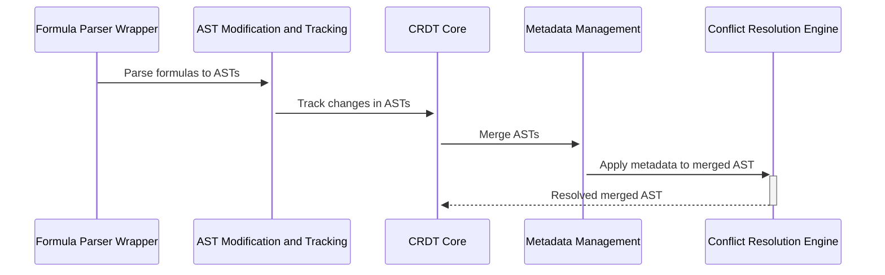

# State Diagrams

## Simplified Sequence Diagram (Mermaid.js Diagram)

## Explanation of the Simplified Diagram:

- **Formula Parser Wrapper (Parser)**: Parses the input formulas into ASTs.
- **AST Modification and Tracking (ASTMod)**: Receives the parsed ASTs and tracks changes.
- **CRDT Core (CRDT)**: Handles the core logic of merging ASTs based on CRDT principles.
- **Metadata Management (MetaData)**: Applies metadata to the merged ASTs, which is important for resolving conflicts.
- **Conflict Resolution Engine (ConflictRes)**: Resolves any conflicts in the merged ASTs and sends the resolved AST back to the CRDT Core.

This simplified sequence diagram is more focused and aligns closely with your boilerplate setup, illustrating the core interactions necessary for CRDT operations. It excludes external interfaces like the user interface and data storage, concentrating on the internal workflow of the CRDT system.
